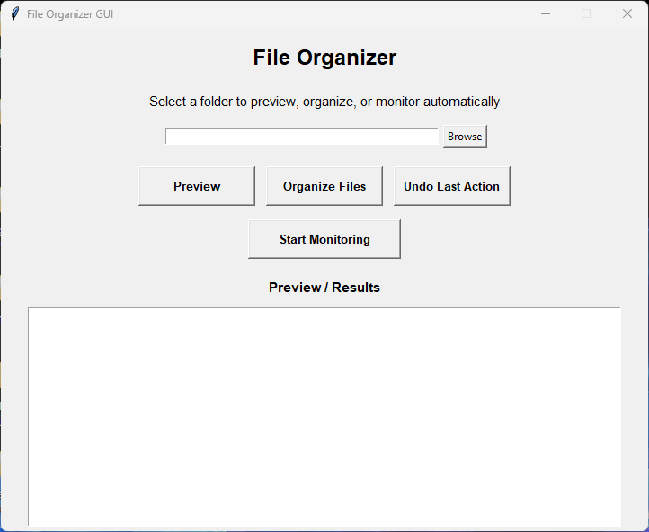
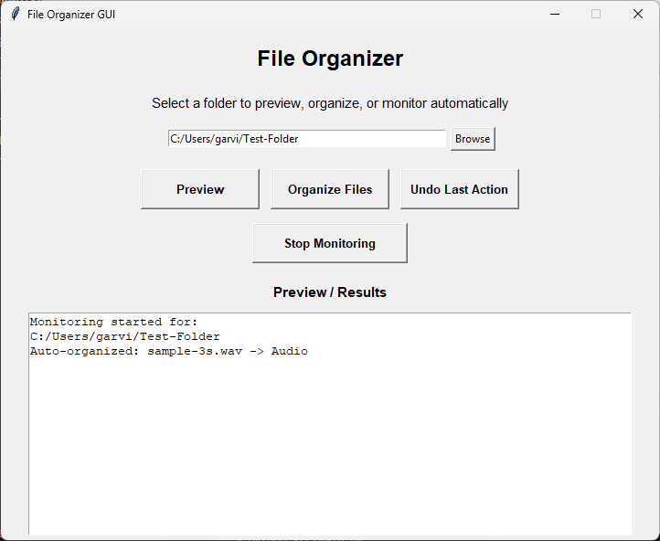
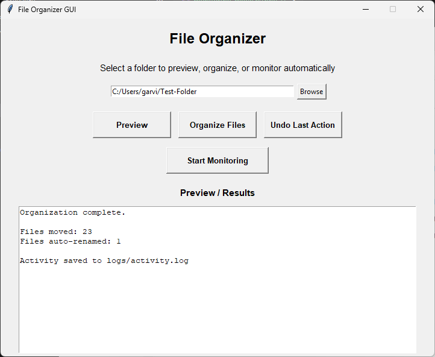
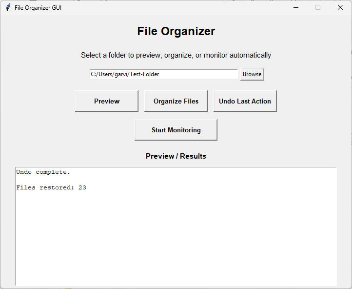

# File Organizer GUI

[](../../releases)

A Python desktop application that automatically organizes files into categorized folders (Images, Videos, Documents, Audio, etc.) using a simple graphical interface.

The tool can preview file organization, automatically sort files, monitor folders in real-time, and undo previous actions.

---

## Features

* Graphical interface built with Tkinter
* Preview file organization before moving files
* Automatically organize files by category
* Real-time folder monitoring
* Undo the last organization action
* Configurable file type rules
* Activity logging for all operations
* Packaged as a standalone Windows executable

---
## 📸 Screenshots

<p align="center">




</p>

<p align="center">




</p>

---

## Project Structure

```

│
├── assets/
├── config/
│   └── file_rules.json
│
├── screenshots/
│
├── src/
│   ├── main.py
│   ├── gui.py
│   ├── organizer.py
│   └── watcher.py
│
├── README.md
├── requirements.txt
└── .gitignore
```

---

## Installation

Clone the repository:

```
git clone https://github.com/garvinedwards717-cloud/FileOrganizer-GUI.git
```

Navigate into the project folder:

```
cd FileOrganizer-GUI
```

Install dependencies:

```
pip install -r requirements.txt
```

Run the application:

```
python src/main.py
```

---

## Usage

1. Launch the application.
2. Select a folder using the **Browse** button.
3. Click **Preview** to see how files will be organized.
4. Click **Organize Files** to automatically sort files into categories.
5. Use **Undo Last Action** if needed.
6. Enable **Monitoring** to automatically organize new files.

---

## Configuration

File categorization rules are defined in:

```
config/file_rules.json
```

You can customize which file extensions belong to each category.

Example:

```
{
  "Images": [".jpg", ".png", ".gif"],
  "Videos": [".mp4", ".mov"],
  "Audio": [".mp3", ".wav"],
  "Documents": [".pdf", ".docx", ".txt"]
}
```

---

## Logging

All operations are recorded in:

```
logs/activity.log
```

This allows users to track file operations and debugging information.

---

## Technologies Used

* Python
* Tkinter
* pathlib
* watchdog (file monitoring)
* PyInstaller (for packaging)

---

## Download

A standalone Windows executable will be available in the **Releases** section.

---

## Author

Garvin Edwards

GitHub:
https://github.com/garvinedwards717-cloud

---
